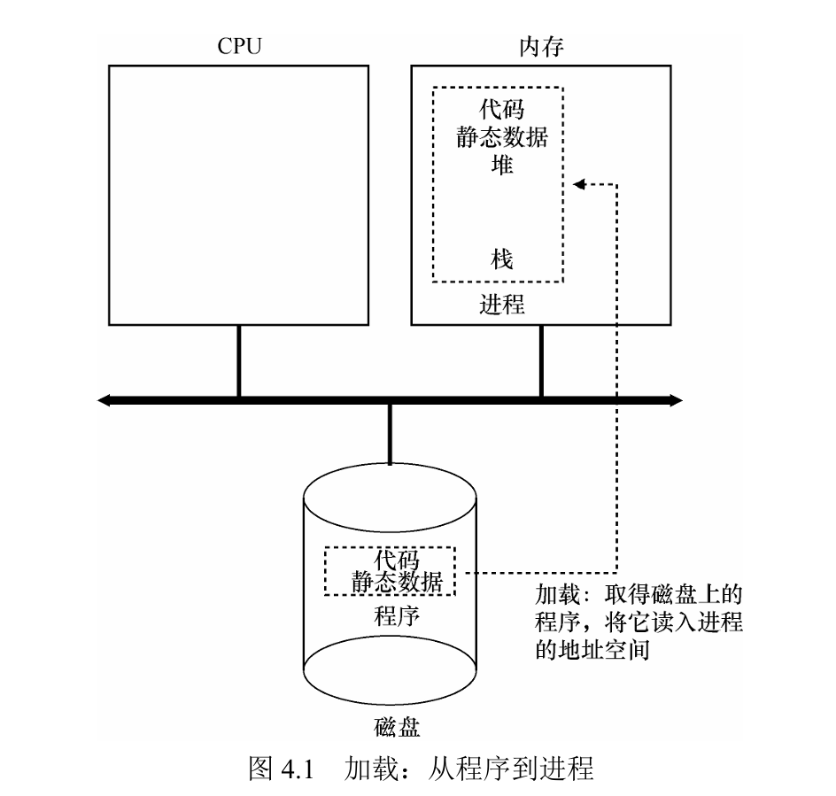
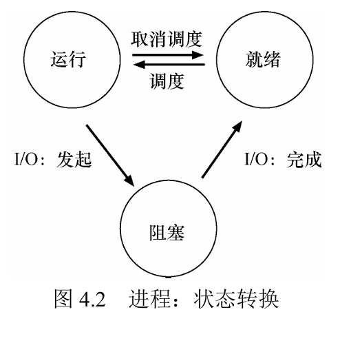

# 抽象:进程

> 参考书目:操作系统导论(Operating Systems Three Easy Piece)
> 参考课程:暂无

---

> `进程`:简单来说就是运行中的 `程序`

那么如何实现同时运行多个程序呢?
OS通过虚拟化cpu来提供这样的假象,每一个程序看似独自占用cpu.其实os通过让一个进程运行一个时间片,然后切换到其他进程(context即上下文),这样便造成了存在多个虚拟cpu的假象----`时分共用`
但会造成性能损失.

如何更好的实现虚拟化cpu,书中提及此时os需要一些 `低级的机制`(简称机制)以及一些 `高级智能`(策略如一些算法--调度策略)

## 进程API

create,destory,wait,miscellaneous control(其他控制),`status`--此处中文版出现错误

## 进程创建

程序如何转化为进程?(具体来说，操作系统如何启动并运
行一个程序？进程创建实际如何进行？)

## 进程状态

进程可以处于以下3种状态之一。

- `运行`（running）：在运行状态下，进程正在处理器上运行。这意味着它正在执行
  指令。
- `就绪`（ready）：在就绪状态下，进程已准备好运行，但由于某种原因，操作系统
  选择不在此时运行。
- `阻塞`（blocked）：在阻塞状态下，一个进程执行了某种操作，直到发生其他事件
  时才会准备运行。一个常见的例子是，当进程向磁盘发起I/O请求时，它会被阻塞，
  因此其他进程可以使用处理器.

